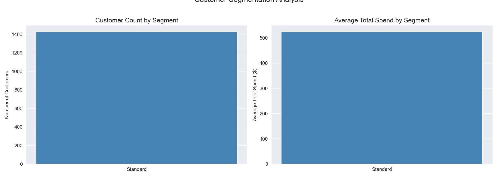
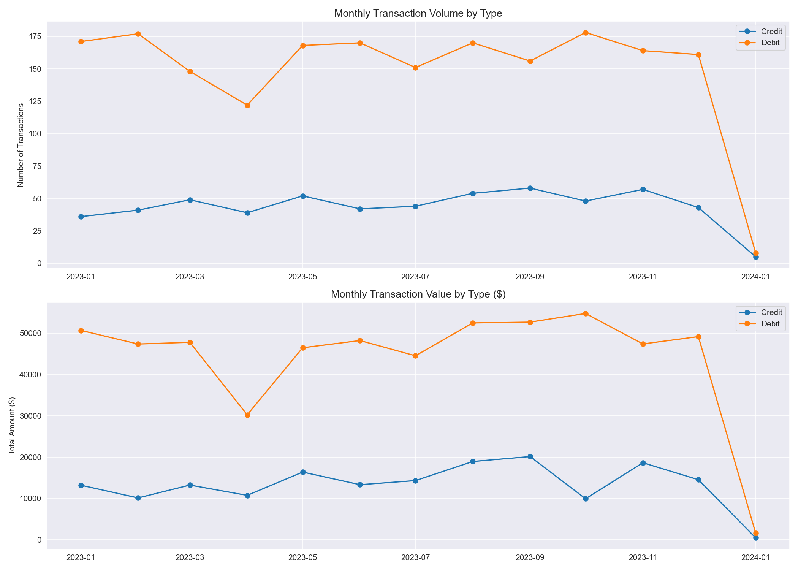
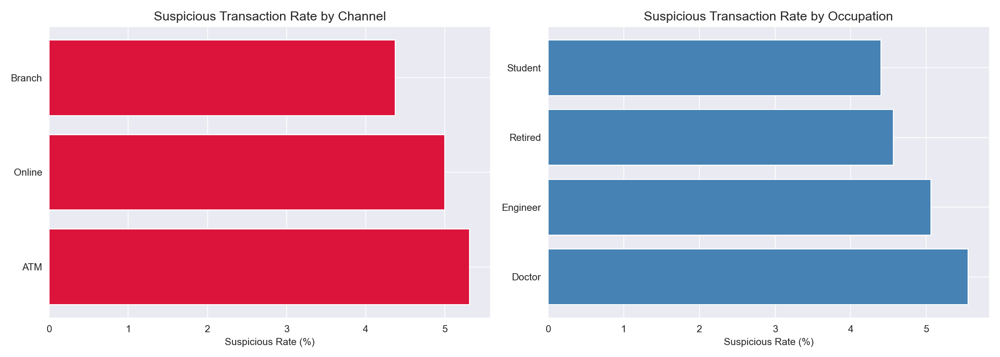
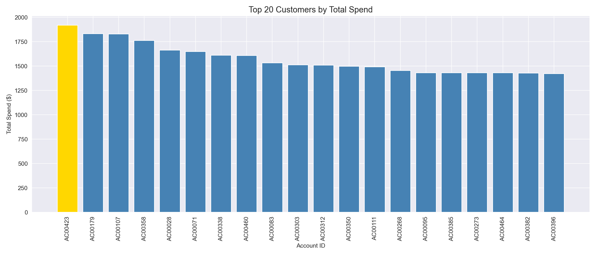

# Banking Transaction Analysis

A SQL and Python analysis of banking transaction data, examining customer spending behavior, fraud patterns, and transaction trends using PostgreSQL and Python.

---

## Problem Statement
Banking institutions need to understand customer behavior and detect fraud patterns to manage risk and improve customer retention. This project uses PostgreSQL for complex querying and aggregation, and Python for visualization and insight communication.

---

## Dataset
- **Source:** [Kaggle — Bank Transaction Dataset](https://www.kaggle.com/datasets/valakhorasani/bank-transaction-dataset-for-fraud-detection)
- **Size:** 2,512 transactions, 1,426 accounts
- **Database:** PostgreSQL (local)

---

## Tools & Libraries
- PostgreSQL, pgAdmin
- Python 3.x
- Pandas, Matplotlib, Seaborn
- SQLAlchemy, psycopg2

---

## Project Workflow
1. Database setup — created PostgreSQL schema and loaded CSV via Python
2. SQL analysis — customer segmentation, monthly trends, fraud analysis, window functions
3. Python visualization — pulled SQL results into Pandas and created charts

---

## SQL Techniques Demonstrated
- Common Table Expressions (CTEs)
- Window functions (RANK, SUM OVER, PARTITION BY)
- Conditional aggregation (CASE WHEN)
- Date truncation and time series aggregation
- Subqueries and multi-step analysis

---

## Key Findings
- All 1,426 accounts classified as Standard segment (avg balance < $50,000), representing a retail banking customer base rather than high-net-worth individuals
- ATM channel showed the highest suspicious transaction rate at **5.31%**, suggesting it as the highest-priority channel for fraud prevention investment
- Doctors had the highest suspicious transaction rate by occupation (**5.55%**), consistent with high-income professionals being frequent fraud targets
- Top spender (AC00423, Doctor) recorded **$1,919.11** in total spend, representing just 0.26% of total platform spend — indicating healthy distribution with no extreme concentration risk
- No single occupation dominated the top 10 spenders, with Doctors and Students each holding 3 of the top 10 positions
- SQL window functions revealed spending ranks both globally and within each occupation group, enabling multi-dimensional customer performance analysis

---

## Visualizations

### Customer Segmentation

### Monthly Transaction Trends

### Fraud Analysis

### Top Spenders

---

## SQL Query Files
All queries are saved in the `sql/` folder:
- `01_create_tables.sql` — schema creation
- `02_customer_summary.sql` — customer segmentation
- `03_transaction_trends.sql` — monthly trends CTE
- `04_fraud_analysis.sql` — fraud rate by category and channel
- `05_window_functions.sql` — customer spending ranks and running totals

---

## How to Run This Project
1. Clone the repository
2. Install PostgreSQL and pgAdmin from [postgresql.org](https://postgresql.org)
3. Create a database called `banking_analysis`
4. Download the dataset from Kaggle and place in the project root
5. Install Python dependencies: `pip install pandas numpy matplotlib seaborn sqlalchemy psycopg2-binary`
6. Run `sql/01_create_tables.sql` in pgAdmin to create the schema
7. Run `banking_analysis.ipynb` — it will load the CSV and run all analysis

---

## Author
**Mihrimah Qozat**
[LinkedIn](https://linkedin.com/in/mihrimah-qozat/) | [GitHub](https://github.com/mihrimahqozat)
